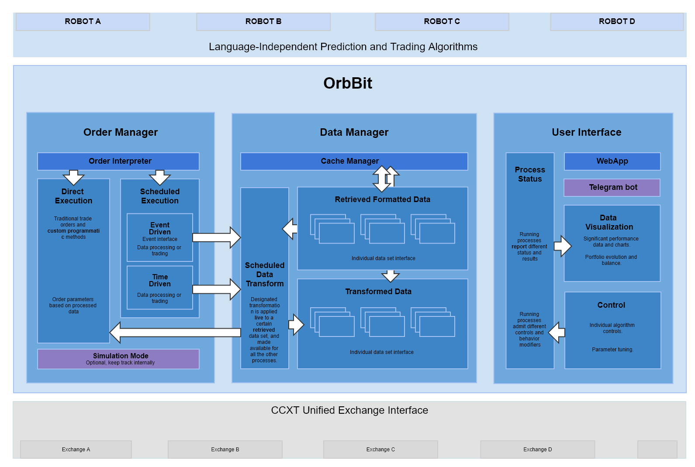

OrbBit - look a bit into the future
===================================
The OrbBit API empowers robots to perform analysis and automatic trading on cryptocurrency markets.



It contains all the functions that:
 - May be used by several robots, so that they are implemented only once. 
 - Optimize operation of the robots, like data acquisition, which has to be done only once for all the robots.

Since it's developed in python, it takes advantage of a huge amount of resources readily available; then, each block presents a standard REST API through a socket. That allows for the robots to be implemented in any language that supports sockets. Development of the robots is this way focused on the algorithm only.


Local install (for development)
------------------------------
This is the most convenient way to develop the API or Robots. You will have the Orbbit package installed via symlink so it will reflect changes as you work. The Spyder IDE will make developmente hugely more comfortable.

0- Install Anaconda (includes Spyder +lots of packages)

1- (command line) Create a conda environment 
```
conda create -n orb_conda anaconda spyder
```

2- Activate the environment (use this command every time you want to work on the project)
```
activate orb_conda
```

3- Keys for the API, database and exchanges are not in version control. To generate them, place the privately-shared folder at the same level as the OrbBit package.
```
OrbBit
OrbBit_noVC
```

Now run run_me.py and all the keys will be generated and placed in the appropriate directory
```
cd OrbBit_noVC
python run_me.py
```

4- cd to the OrbBit package dir and install it
```
pip install -e .
```


To launch the Spyder IDE, always make sure you do it from inside the correct environment:
```
activate orb_conda
spyder
```


Inside Spyder, you can do a test run of the package starting the data fetcher
```
import orbbit as orb
orb.start_DataManager_API()
```

and you should see that the API has started on localhost
```
Starting API Server.
DataManager_API STARTED with threadID Thread-6
 * Running on http://127.0.0.1:5000/ (Press CTRL+C to quit)
```


Now you can go to these addresses right from your brower. That will start all the previously loaded fetchers.

http://127.0.0.1:5000/datamanager/fetch/start

```
Inserted 1514038080000
Inserted 1514038080000
Inserted 1514038080000
Inserted 1514038140000
Inserted 1514038140000
Inserted 1514038140000
...
```
